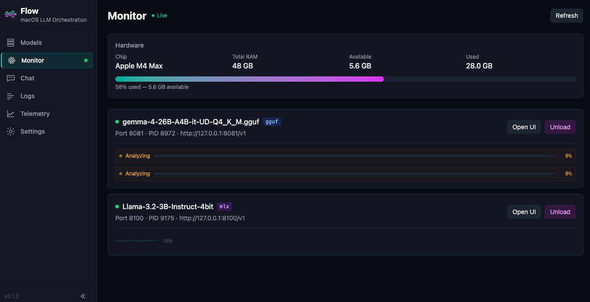

# Flow LLM — macOS LLM Orchestration

An alternative to Ollama and LM Studio for running local models with AI coding agents. Flow is a local LLM gateway for Apple Silicon that manages GGUF and MLX models, proxies OpenAI- and Anthropic-compatible API requests, and exposes real-time telemetry — so tools like OpenClaw, Hermes, Claude Code, and Codex (via AIRun) can talk to local models without Ollama or LM Studio.



## Quick Install

```bash
curl -fsSL https://raw.githubusercontent.com/styles01/flow-llm/main/setup.sh | bash
```

Or clone and run manually:

```bash
git clone https://github.com/styles01/flow-llm.git
cd flow-llm && ./setup.sh
```

## Prerequisites

Flow LLM requires **inference backends** to run models. Install at least one:

### llama.cpp (required for GGUF models)

```bash
brew install llama.cpp
```

### mlx-openai-server (optional, for MLX models)

```bash
pip install mlx-openai-server
```

## Quick Start

### 1. Install and run

```bash
git clone https://github.com/styles01/flow-llm.git
cd flow-llm && ./setup.sh
flow
```

Open **http://localhost:3377** — everything (API + UI) is served from a single process.

### 2. Connect a model

If you already have a llama-server running (e.g. from `gemma4.sh`):

1. Open Flow UI → **Models** → **Connect Running Model**
2. Enter the URL (e.g. `http://127.0.0.1:8081`)
3. Click **Connect** — Flow auto-detects the model name

Or register a local GGUF file and load through Flow:

```bash
curl -X POST http://localhost:3377/api/register-local \
  -H "Content-Type: application/json" \
  -d '{"gguf_path": "/path/to/model.gguf"}'
```

Then load it in the UI with your preferred settings (100K context, flash attention, q4_0 KV cache).

### 3. Configure your coding tool

Point OpenClaw, Claude Code, or Codex (via AIRun) to Flow:

```json
{
  "models": {
    "providers": {
      "flow": {
        "baseUrl": "http://127.0.0.1:3377/v1",
        "apiKey": "flow-local",
        "api": "openai-completions"
      }
    }
  }
}
```

Flow also exposes an Anthropic-compatible endpoint at `POST /v1/messages` for Claude Code and other tools that use the Anthropic Messages API.

## Development

For contributors who want to work on the frontend with hot reload:

```bash
cd server && pip install -e .
cd ../web && npm install && npm run dev
```

Frontend dev server runs at **http://localhost:5173** and proxies API requests to the backend.

To rebuild the bundled frontend after changes:

```bash
./build_frontend.sh
```

## Dependencies

### Required

| Dependency | Purpose | Install |
|-----------|---------|---------|
| Python 3.11+ | Runtime | System |
| llama.cpp | GGUF inference backend | `brew install llama.cpp` |
| Node.js 18+ | Frontend build | `brew install node` |

### Python packages (installed via `pip install -e .`)

| Package | Purpose |
|---------|---------|
| fastapi | Management server and API |
| uvicorn | ASGI server |
| httpx | Async HTTP proxy |
| sqlalchemy | Model registry (SQLite) |
| huggingface-hub | Model search and download |
| jinja2 | Chat template validation |
| psutil | Hardware detection |
| pydantic | Request/response models |
| websockets | Real-time updates |

### Optional

| Dependency | Purpose | Install |
|-----------|---------|---------|
| mlx-openai-server | MLX inference backend | `pip install mlx-openai-server` |

## Architecture

See [docs/architecture.md](docs/architecture.md) for the full design.

## Key Files

| File | Purpose |
|------|---------|
| `server/flow_llm/main.py` | FastAPI app with all API routes |
| `server/flow_llm/process_manager.py` | Starts/stops llama.cpp and mlx-openai-server; also manages external processes |
| `server/flow_llm/hf_client.py` | HuggingFace search and download |
| `server/flow_llm/template_validator.py` | Validates chat templates before loading |
| `server/flow_llm/database.py` | SQLite model registry |
| `server/flow_llm/hardware.py` | Apple Silicon detection |
| `server/flow_llm/config.py` | Default and persisted settings (port 3377, load defaults, auto-update toggle) |
| `server/flow_llm/updater.py` | Backend version detection and update helpers for llama.cpp and mlx-openai-server |
| `web/src/pages/Models.tsx` | Model management with HF search, local registration, connect external |
| `web/src/pages/Chat.tsx` | Chat test with system prompt editor, streaming SSE, tool calling |
| `web/src/pages/Running.tsx` | Running models dashboard with memory bar and live slot/KV activity |
| `web/src/pages/Logs.tsx` | Backend log viewer with per-model filtering |
| `web/src/pages/Settings.tsx` | Persisted load defaults, backend versions, update controls, hardware info |
| `web/src/pages/Telemetry.tsx` | Request log table |
| `web/src/components/LoadDialog.tsx` | Model loading controls (context, parallel slots, flash attention, KV cache) |
| `web/src/api/client.ts` | API client for frontend |

## Development

| File | Purpose |
|------|---------|
| `gemma4.sh` | Launch script for Gemma 4 on llama-server |
| `start.sh` | Start backend + frontend |
| `.vscode/launch.json` | VS Code debug configuration |

## License

[MIT](LICENSE)

## Port Layout

| Port | Service |
|------|---------|
| 3377 | Flow management server |
| 5173 | Frontend dev server (Vite) |
| 8081+ | llama.cpp backend processes |
| 8100+ | mlx-openai-server backend processes |

## API Endpoints

### Management API

| Method | Endpoint | Purpose |
|--------|----------|---------|
| GET | `/api/hardware` | Hardware info (chip, memory, Metal support) |
| GET | `/api/models` | List all registered models |
| GET | `/api/models/{id}` | Get model details |
| GET | `/api/models/running` | List running models with live status |
| POST | `/api/models/{id}/load` | Load a model (start backend process) |
| POST | `/api/models/{id}/unload` | Unload a model (stop backend process) |
| DELETE | `/api/models/{id}` | Delete a model from disk and registry |
| POST | `/api/models/download` | Download from HuggingFace |
| POST | `/api/models/scan` | Scan local files for unregistered GGUF |
| POST | `/api/register-local` | Register an existing GGUF file |
| POST | `/api/connect-external` | Connect to an already-running backend |
| GET | `/api/settings` | Get default model loading settings |
| PUT | `/api/settings` | Update default settings |
| GET | `/api/downloads` | Get active/recent download progress |
| GET | `/api/hf/search?q=` | Search HuggingFace models |
| GET | `/api/hf/model/{id}` | Get HuggingFace model details |
| GET | `/api/telemetry` | Get telemetry records |
| GET | `/api/backend-versions` | Get installed/latest backend versions |
| POST | `/api/check-updates` | Trigger backend version check |
| POST | `/api/update-backend/{backend}` | Trigger backend update |
| GET | `/api/processing-progress` | Get prefill progress for active models |
| GET | `/api/logs` | Get recent backend logs |
| GET | `/api/model-activity` | Get live per-slot activity and llama.cpp metrics |
| GET | `/api/health` | Health check |

### OpenAI-Compatible Proxy

| Method | Endpoint | Purpose |
|--------|----------|---------|
| POST | `/v1/chat/completions` | Route to backend by model name (streaming + non-streaming) |
| POST | `/v1/messages` | Anthropic-compatible Messages API (for Claude Code / AI-run) |
| GET | `/v1/models` | List available models |

### WebSocket

| Endpoint | Purpose |
|----------|---------|
| `/ws` | Real-time lifecycle events (`model_loaded`, `model_unloaded`, `model_downloaded`, `model_deleted`) |

## Connect External Backend

Flow can connect to an already-running backend (like a manually-started llama-server) without restarting it:

```bash
curl -X POST http://localhost:3377/api/connect-external \
  -H "Content-Type: application/json" \
  -d '{"base_url": "http://127.0.0.1:8081"}'
```

This auto-detects the model name from the backend and registers it as running. The proxy will route requests to it. Unloading an external model kills the backend process and frees memory.

## Model Loading Defaults

Flow ships with sensible defaults for Apple Silicon:

- **Context window**: 100,000 tokens (OpenClaw needs large context)
- **Flash attention**: On (critical for long context)
- **KV cache**: q4_0 quantization (75% memory savings, enables 100K context on 48GB)
- **GPU layers**: -1 (all layers on Metal)
- **Parallel slots**: 2 (for concurrent agent requests)
- **Auto-update backends**: On (checks versions on startup and can auto-upgrade supported installs)

These can be changed in the Settings page, are used as defaults in the Load dialog and Chat page, and are persisted to `~/.flow/settings.json`.
